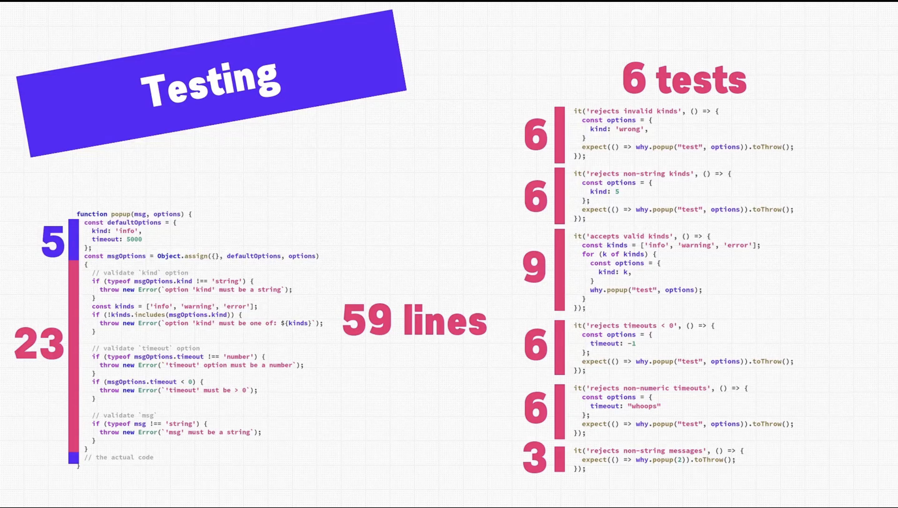
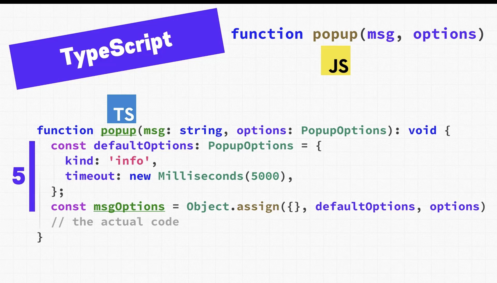
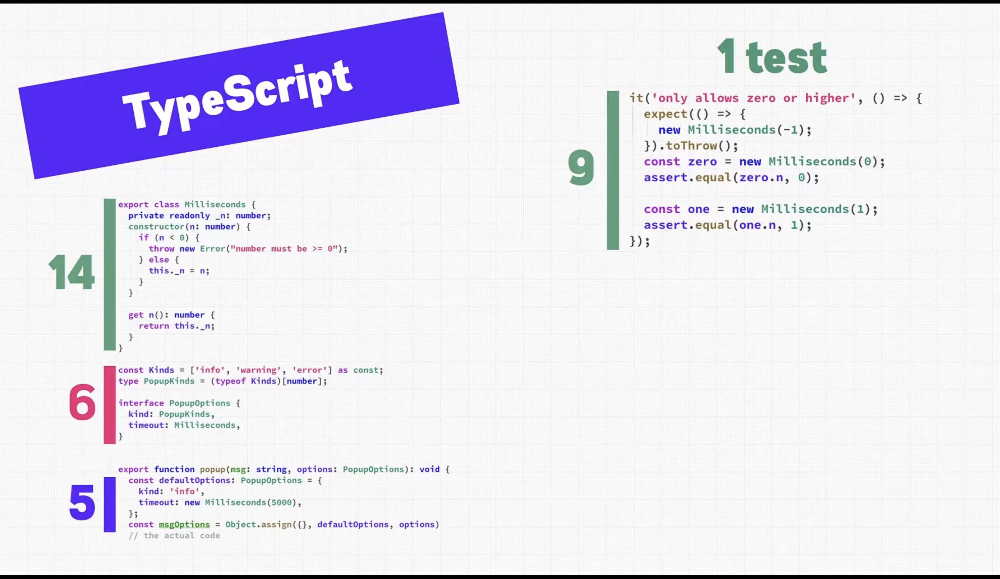
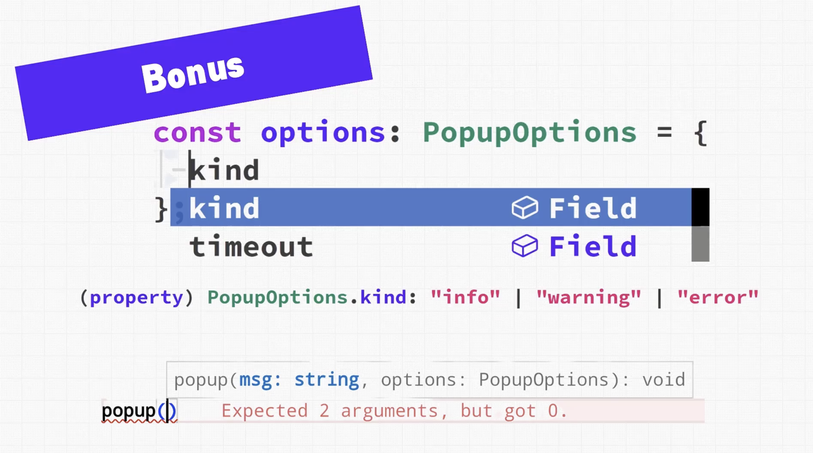

Why Learn TypeScript When We Already Have JavaScript?

## Big question

If JavaScript already works, why add TypeScript on top of it? To answer this properly we need to understand where JavaScript struggles—especially as code grows and is shared across teams.

---

## A simple JavaScript example: popup

Imagine a JavaScript function:

```js
popup(message, options)
```

This function:
- Shows a popup to the user
- Takes a message
- Takes some options

Sounds simple, but problems appear immediately.

---

## Problem 1 — No clarity on parameters

What is `message`?
- Is it text?
- A number?
- An object?

We usually assume it's text, but JavaScript doesn't tell us.

What is `options`?
- What properties does it have?
- Are they required?
- Are there defaults?
- What happens if we pass too many or too few?

There is no built-in way to know this. To use the function safely we must read the source or rely on (sometimes out-of-date) documentation.

---

## Digging into the JavaScript code

Inside the function we might find default options like:

```js
// defaults (inferred by reading code)
kind: "info"
timeout: 5000
```

From the implementation we learn:
- There is a `kind` option (maybe "info", "error", "warning")
- There is a `timeout`
- `5000` is probably milliseconds (but not documented)

None of this is obvious from the function signature.

---

## Problem 2 — Massive boilerplate code

Because JavaScript doesn't enforce types, the function must validate inputs at runtime:
- Is `message` provided?
- Is `timeout` a number?
- Is `timeout` positive?
- Is `kind` supported?

As a result you often end up with far more code for validation than for the real logic:
- 5 lines → actual defaults
- 23 lines → argument validation
- 6 test cases → just to check bad inputs
- 0 lines → actual popup logic

This boilerplate is repetitive, error-prone, hard to reuse, and exists because JavaScript doesn't describe data clearly.



---

## Enter TypeScript

Now the same function in TypeScript becomes clearer:

```ts
function popup(message: string, options?: PopupOptions) {
  // ...
}
```



Immediately we know:
- `message` must be a `string`
- `options` must follow the `PopupOptions` shape

No guessing, no digging.

### Popup options defined explicitly

```ts
type PopupOptions = {
  kind?: "info" | "error" | "warning";
  timeout?: number; // milliseconds
}
```

What this gives us:
- Allowed popup kinds are explicit
- Timeout unit (milliseconds) is documented in the type
- Optional vs required fields are clear

The code itself becomes documentation.

---

## Less boilerplate, same safety

JavaScript:
- Needs runtime checks
- Needs many tests for invalid input
- Errors may happen at runtime

TypeScript:
- Errors are caught while typing
- Invalid calls are hard to write
- Many runtime checks become unnecessary



Some JavaScript errors literally cannot exist in TypeScript.

---

## Code comparison

| Metric | JavaScript | TypeScript |
|---|---:|---:|
| Boilerplate code | High | Zero |
| Tests for invalid input | Many | Fewer |
| Runtime safety | Low | High |
| Reusability | Poor | Strong |
| Total code size | Larger | 38% less |

---

## Huge bonus: Editor superpowers

Because TypeScript encodes information into the type system, your editor can:
- Auto-suggest available options
- Show allowed popup kinds
- Warn instantly about mistakes
- Guide you as you type

Result:
- Faster development
- Fewer bugs
- Much higher confidence



---

## Final takeaway

TypeScript doesn't replace JavaScript — it upgrades it.

You get:
- Less code
- Fewer tests
- Better documentation
- Higher reliability
- Smarter tooling

If writing cleaner, safer, and more maintainable code matters to you, TypeScript is absolutely worth learning.

---